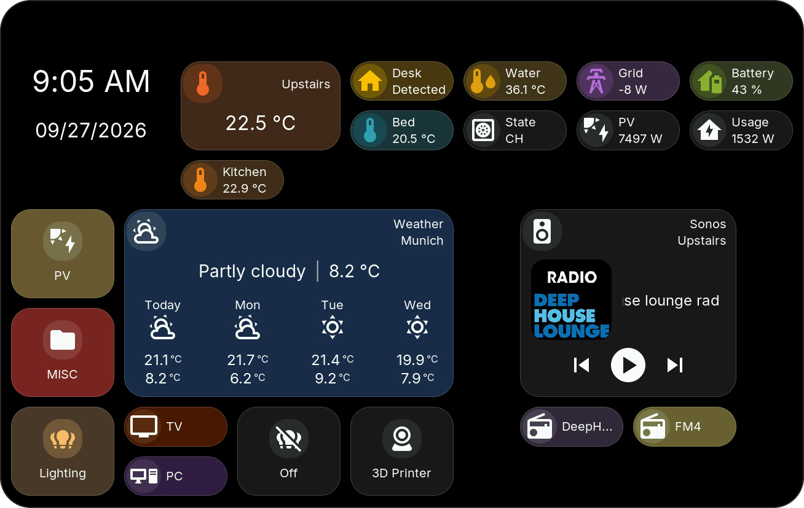
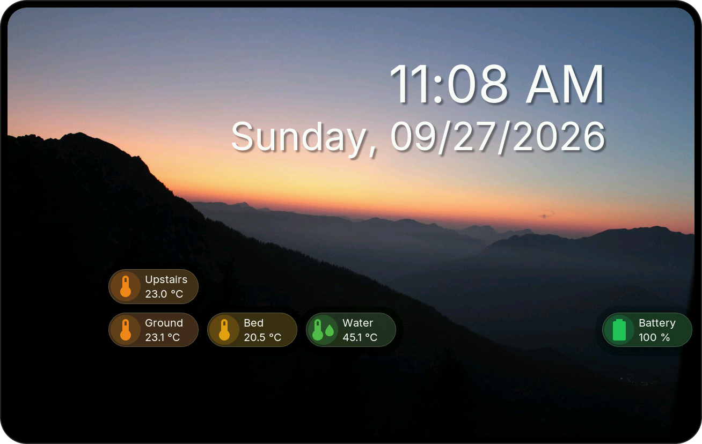

# HomeTiles

HomeTiles is free, open-source firmware that turns a supported touch display into a Home Assistant control panel. Use tiles to switch lights, adjust heating, control music, and see sensor or energy data at a glance.

## Get started

1. [Flash the firmware](installer.md) using the online flasher. Choose your exact device and installation mode.
2. [Connect Home Assistant](home-assistant-setup.md) through the MQTT broker and HomeTiles Bridge.
3. [Configure your dashboard](web-admin.md) in the display's Web Admin panel.
4. [Use the display](device-ui.md) to control devices and view their data.

## Features

- **Controls:** lights, switches, covers, heating, media, numbers, selections and date/time values.
- **Sensors & energy:** live values, state history, energy statistics and weather.
- **Dashboard:** arrange tiles and folders in half steps with a live browser preview; open views from Home Assistant.
- **Colors:** icon circles, tile colors from the icon, and rules that color tiles by an entity's state.
- **Screensaver:** display a clock, photos and sensor tiles.
- **Local hardware:** use supported GPIO outputs, relays and temperature sensors.
- **Updates:** install firmware from the display or your browser.
- **Camera:** live video on ESP32-P4 displays; supported displays share their built-in camera with Home Assistant.

<figure class="ht-screenshot">

<figcaption>HomeTiles dashboard</figcaption>
</figure>

<figure class="ht-screenshot">

<figcaption>Screensaver with clock and sensor tiles</figcaption>
</figure>

[All tile types](tiles.md) and [screensaver configuration](screensaver.md).

## Demo

This video shows an older version. The current release is faster and looks better; a new demo video will follow soon.

<figure class="ht-screenshot">
<video class="ht-demo" controls playsinline preload="metadata" poster="images/hometiles-demo-poster.jpg" aria-label="HomeTiles device demo">
<source src="videos/hometiles-demo.mp4" type="video/mp4">
</video>
<figcaption>HomeTiles device demo</figcaption>
</figure>

## Device Support

Match the exact hardware revision before flashing. [Open online flasher](installer.md#browser-installer).

### ESP32-P4

| Model | Display | Status | Link |
| --- | --- | --- | --- |
| M5Stack Tab5 | 5" / 1280×720 | Tested <button type="button" class="ht-device-info" popovertarget="device-note-1" aria-controls="device-note-1" aria-expanded="false" aria-label="Support details for M5Stack Tab5"><svg viewBox="0 0 16 16" fill="none" stroke="currentColor" stroke-width="1.2" aria-hidden="true"><circle cx="8" cy="8" r="6.5"/><path d="M8 7v4"/><circle cx="8" cy="4.5" r=".7" fill="currentColor" stroke="none"/></svg></button> | [Link](https://shop.m5stack.com/products/m5stack-tab5-iot-development-kit-esp32-p4) |
| Waveshare LCD-4B (P4) | 4" / 720×720 | Tested <button type="button" class="ht-device-info" popovertarget="device-note-2" aria-controls="device-note-2" aria-expanded="false" aria-label="Support details for Waveshare LCD-4B (P4)"><svg viewBox="0 0 16 16" fill="none" stroke="currentColor" stroke-width="1.2" aria-hidden="true"><circle cx="8" cy="8" r="6.5"/><path d="M8 7v4"/><circle cx="8" cy="4.5" r=".7" fill="currentColor" stroke="none"/></svg></button> | [Link](https://www.waveshare.com/esp32-p4-wifi6-touch-lcd-4b.htm) |
| Waveshare 86 Panel ETH-2RO | 4" / 720×720 | Tested <button type="button" class="ht-device-info" popovertarget="device-note-3" aria-controls="device-note-3" aria-expanded="false" aria-label="Support details for Waveshare 86 Panel ETH-2RO"><svg viewBox="0 0 16 16" fill="none" stroke="currentColor" stroke-width="1.2" aria-hidden="true"><circle cx="8" cy="8" r="6.5"/><path d="M8 7v4"/><circle cx="8" cy="4.5" r=".7" fill="currentColor" stroke="none"/></svg></button> | [Link](https://www.waveshare.net/shop/ESP32-P4-86-Panel-ETH-2RO.htm) |
| Waveshare LCD-8 (P4) | 8" / 1280×800 | Tested <button type="button" class="ht-device-info" popovertarget="device-note-4" aria-controls="device-note-4" aria-expanded="false" aria-label="Support details for Waveshare LCD-8 (P4)"><svg viewBox="0 0 16 16" fill="none" stroke="currentColor" stroke-width="1.2" aria-hidden="true"><circle cx="8" cy="8" r="6.5"/><path d="M8 7v4"/><circle cx="8" cy="4.5" r=".7" fill="currentColor" stroke="none"/></svg></button> | [Link](https://www.waveshare.com/esp32-p4-wifi6-touch-lcd-7-8-10.1.htm) |
| Guition JC8012P4A1 V1 | 10.1" / 1280×800 | Tested <button type="button" class="ht-device-info" popovertarget="device-note-5" aria-controls="device-note-5" aria-expanded="false" aria-label="Support details for Guition JC8012P4A1 V1"><svg viewBox="0 0 16 16" fill="none" stroke="currentColor" stroke-width="1.2" aria-hidden="true"><circle cx="8" cy="8" r="6.5"/><path d="M8 7v4"/><circle cx="8" cy="4.5" r=".7" fill="currentColor" stroke="none"/></svg></button> | [Link](https://www.guition.com/esp32p4-display-module/hmi-display-panel) |
| Waveshare LCD-4.3 (P4) | 4.3" / 800×480 | Partial <button type="button" class="ht-device-info" popovertarget="device-note-6" aria-controls="device-note-6" aria-expanded="false" aria-label="Support details for Waveshare LCD-4.3 (P4)"><svg viewBox="0 0 16 16" fill="none" stroke="currentColor" stroke-width="1.2" aria-hidden="true"><circle cx="8" cy="8" r="6.5"/><path d="M8 7v4"/><circle cx="8" cy="4.5" r=".7" fill="currentColor" stroke="none"/></svg></button> | [Link](https://www.waveshare.com/esp32-p4-wifi6-touch-lcd-4.3.htm) |
| Waveshare LCD-7 (P4) | 7" / 1280×720 | Pending <button type="button" class="ht-device-info" popovertarget="device-note-7" aria-controls="device-note-7" aria-expanded="false" aria-label="Support details for Waveshare LCD-7 (P4)"><svg viewBox="0 0 16 16" fill="none" stroke="currentColor" stroke-width="1.2" aria-hidden="true"><circle cx="8" cy="8" r="6.5"/><path d="M8 7v4"/><circle cx="8" cy="4.5" r=".7" fill="currentColor" stroke="none"/></svg></button> | [Link](https://www.waveshare.com/esp32-p4-wifi6-touch-lcd-7-8-10.1.htm) |
| Waveshare 7B/7B-C (P4 pre-v3) | 7" / 1024×600 | Pending <button type="button" class="ht-device-info" popovertarget="device-note-8" aria-controls="device-note-8" aria-expanded="false" aria-label="Support details for Waveshare 7B/7B-C (P4 pre-v3)"><svg viewBox="0 0 16 16" fill="none" stroke="currentColor" stroke-width="1.2" aria-hidden="true"><circle cx="8" cy="8" r="6.5"/><path d="M8 7v4"/><circle cx="8" cy="4.5" r=".7" fill="currentColor" stroke="none"/></svg></button> | [Link](https://www.waveshare.com/esp32-p4-wifi6-touch-lcd-7B.htm) |
| Waveshare 7B/7B-C (P4 v3.1) | 7" / 1024×600 | Experimental <button type="button" class="ht-device-info" popovertarget="device-note-9" aria-controls="device-note-9" aria-expanded="false" aria-label="Support details for Waveshare 7B/7B-C (P4 v3.1)"><svg viewBox="0 0 16 16" fill="none" stroke="currentColor" stroke-width="1.2" aria-hidden="true"><circle cx="8" cy="8" r="6.5"/><path d="M8 7v4"/><circle cx="8" cy="4.5" r=".7" fill="currentColor" stroke="none"/></svg></button> | [Link](https://www.waveshare.com/esp32-p4-wifi6-touch-lcd-7B.htm) |
| Waveshare LCD-10.1 (P4) | 10.1" / 1280×800 | Partial <button type="button" class="ht-device-info" popovertarget="device-note-10" aria-controls="device-note-10" aria-expanded="false" aria-label="Support details for Waveshare LCD-10.1 (P4)"><svg viewBox="0 0 16 16" fill="none" stroke="currentColor" stroke-width="1.2" aria-hidden="true"><circle cx="8" cy="8" r="6.5"/><path d="M8 7v4"/><circle cx="8" cy="4.5" r=".7" fill="currentColor" stroke="none"/></svg></button> | [Link](https://www.waveshare.com/esp32-p4-wifi6-touch-lcd-7-8-10.1.htm) |
| Guition JC8012P4A1 V2 | 10.1" / 1280×800 | Tested <button type="button" class="ht-device-info" popovertarget="device-note-11" aria-controls="device-note-11" aria-expanded="false" aria-label="Support details for Guition JC8012P4A1 V2"><svg viewBox="0 0 16 16" fill="none" stroke="currentColor" stroke-width="1.2" aria-hidden="true"><circle cx="8" cy="8" r="6.5"/><path d="M8 7v4"/><circle cx="8" cy="4.5" r=".7" fill="currentColor" stroke="none"/></svg></button> | [Link](https://www.guition.com/esp32p4-display-module/hmi-display-panel) |
| Guition JC1060P470C V1 | 7" / 1024×600 | Tested <button type="button" class="ht-device-info" popovertarget="device-note-12" aria-controls="device-note-12" aria-expanded="false" aria-label="Support details for Guition JC1060P470C V1"><svg viewBox="0 0 16 16" fill="none" stroke="currentColor" stroke-width="1.2" aria-hidden="true"><circle cx="8" cy="8" r="6.5"/><path d="M8 7v4"/><circle cx="8" cy="4.5" r=".7" fill="currentColor" stroke="none"/></svg></button> | [Link](https://www.guition.com/esp32p4-display-module/7-inch-esp32p4-display-module) |
| Guition JC1060P470C V2 | 7" / 1024×600 | Partial <button type="button" class="ht-device-info" popovertarget="device-note-13" aria-controls="device-note-13" aria-expanded="false" aria-label="Support details for Guition JC1060P470C V2"><svg viewBox="0 0 16 16" fill="none" stroke="currentColor" stroke-width="1.2" aria-hidden="true"><circle cx="8" cy="8" r="6.5"/><path d="M8 7v4"/><circle cx="8" cy="4.5" r=".7" fill="currentColor" stroke="none"/></svg></button> | [Link](https://www.guition.com/esp32p4-display-module/7-inch-esp32p4-display-module) |
| Guition JC4880P443 | 4.3" / 480×800 | Pending <button type="button" class="ht-device-info" popovertarget="device-note-17" aria-controls="device-note-17" aria-expanded="false" aria-label="Support details for Guition JC4880P443"><svg viewBox="0 0 16 16" fill="none" stroke="currentColor" stroke-width="1.2" aria-hidden="true"><circle cx="8" cy="8" r="6.5"/><path d="M8 7v4"/><circle cx="8" cy="4.5" r=".7" fill="currentColor" stroke="none"/></svg></button> | [Link](https://www.guition.com/esp32p4-display-module/esp32p4-display) |

### ESP32-S3

| Model | Display | Status | Link |
| --- | --- | --- | --- |
| Guition ESP32-4848S040C_I | 4" / 480×480 | Tested <button type="button" class="ht-device-info" popovertarget="device-note-14" aria-controls="device-note-14" aria-expanded="false" aria-label="Support details for Guition ESP32-4848S040C_I"><svg viewBox="0 0 16 16" fill="none" stroke="currentColor" stroke-width="1.2" aria-hidden="true"><circle cx="8" cy="8" r="6.5"/><path d="M8 7v4"/><circle cx="8" cy="4.5" r=".7" fill="currentColor" stroke="none"/></svg></button> | [Link](https://www.guition.com/esp32-display-module/4-inch-esp32s3-display-module) |
| Waveshare LCD-4 Rev 4.0 (S3) | 4" / 480×480 | Tested <button type="button" class="ht-device-info" popovertarget="device-note-15" aria-controls="device-note-15" aria-expanded="false" aria-label="Support details for Waveshare LCD-4 Rev 4.0 (S3)"><svg viewBox="0 0 16 16" fill="none" stroke="currentColor" stroke-width="1.2" aria-hidden="true"><circle cx="8" cy="8" r="6.5"/><path d="M8 7v4"/><circle cx="8" cy="4.5" r=".7" fill="currentColor" stroke="none"/></svg></button> | [Link](https://www.waveshare.com/product/esp32-s3-touch-lcd-4.htm) |
| Waveshare LCD-4B (S3) | 4" / 480×480 | Pending <button type="button" class="ht-device-info" popovertarget="device-note-16" aria-controls="device-note-16" aria-expanded="false" aria-label="Support details for Waveshare LCD-4B (S3)"><svg viewBox="0 0 16 16" fill="none" stroke="currentColor" stroke-width="1.2" aria-hidden="true"><circle cx="8" cy="8" r="6.5"/><path d="M8 7v4"/><circle cx="8" cy="4.5" r=".7" fill="currentColor" stroke="none"/></svg></button> | [Link](https://www.waveshare.com/esp32-s3-touch-lcd-4b.htm) |

M5Stack Tab5
<button type="button" class="ht-device-note-close" aria-label="Close support details">×</button>
Hardware-tested by the maintainer.

Waveshare LCD-4B (P4)
<button type="button" class="ht-device-note-close" aria-label="Close support details">×</button>
Hardware-tested by the maintainer. A brief blue flash while saving or updating is a known display limitation.

<a href="faq/#the-display-briefly-flashes-blue-when-saving-or-updating-waveshare">Display note</a>

Waveshare 86 Panel ETH-2RO
<button type="button" class="ht-device-note-close" aria-label="Close support details">×</button>
Hardware operation and native Ethernet are confirmed. Uses the ESP32-P4 LCD-4B firmware.

Waveshare LCD-8 (P4)
<button type="button" class="ht-device-note-close" aria-label="Close support details">×</button>
Hardware-tested by the maintainer. A brief blue flash while saving or updating is a known display limitation.

<a href="faq/#the-display-briefly-flashes-blue-when-saving-or-updating-waveshare">Display note</a>

Guition JC8012P4A1 V1
<button type="button" class="ht-device-note-close" aria-label="Close support details">×</button>
v0.6.10 includes the V1-specific SDIO receive fix. Camera streams and Web Admin OTA were confirmed stable in the integrated v0.6.9b1 test build. Camera remains experimental.

<a href="https://github.com/GalusPeres/HomeTiles/issues/30">Issue #30</a><a href="https://github.com/GalusPeres/HomeTiles/issues/30#issuecomment-5530898054">Test build</a>

Waveshare LCD-4.3 (P4)
<button type="button" class="ht-device-note-close" aria-label="Close support details">×</button>
Display, touch, Wi-Fi, MQTT, Home Assistant and Weather are verified. microSD and OTA checks are still pending.

Waveshare LCD-7 (P4)
<button type="button" class="ht-device-note-close" aria-label="Close support details">×</button>
Firmware is available, but hardware validation is still requested. This 1280 × 720 model uses different firmware from LCD-7B.

<a href="https://github.com/GalusPeres/HomeTiles/issues/7">Issue #7</a>

Waveshare 7B/7B-C (P4 pre-v3)
<button type="button" class="ht-device-note-close" aria-label="Close support details">×</button>
A 7B-C was reported working with v0.6.8, without an exact chip revision in the report. Confirmation for this pre-v3 profile is still needed.

<a href="https://github.com/GalusPeres/HomeTiles/issues/7">Issue #7</a><a href="https://github.com/GalusPeres/HomeTiles/issues/7#issuecomment-5398279624">Test report</a>

Waveshare 7B/7B-C (P4 v3.1)
<button type="button" class="ht-device-note-close" aria-label="Close support details">×</button>
Dedicated firmware for exact ESP32-P4 v3.1. Hardware validation for this revision is still pending; v3.2 and newer are unsupported.

<a href="https://github.com/GalusPeres/HomeTiles/issues/7">Issue #7</a>

Waveshare LCD-10.1 (P4)
<button type="button" class="ht-device-note-close" aria-label="Close support details">×</button>
Display, touch, Wi-Fi, MQTT and OTA were reported working. Corrected defaults, SD and Camera still need release validation. From v0.7.0, boards with ESP32-P4 v3.1 or newer get a separate experimental firmware (contributor-tested on v3.2).

<a href="https://github.com/GalusPeres/HomeTiles/issues/7">Issue #7</a>

Guition JC8012P4A1 V2
<button type="button" class="ht-device-note-close" aria-label="Close support details">×</button>
Maintainer-tested on JC8012P4A1C_I_W_Y1, SKU:10153002-V2. Display, touch, brightness, MQTT and microSD are confirmed. The interface runs smoothly with the v0.6.12 PPA correction. The SD reboot reported on another unit in issue #55 remains under investigation.

<a href="https://github.com/GalusPeres/HomeTiles/issues/18">Issue #18</a> <a href="https://github.com/GalusPeres/HomeTiles/releases/tag/v0.6.12">v0.6.12</a> <a href="https://github.com/GalusPeres/HomeTiles/issues/55">Issue #55</a>

Guition JC1060P470C V1
<button type="button" class="ht-device-note-close" aria-label="Close support details">×</button>
Touch, brightness, SD, Wi-Fi/MQTT and OTA were confirmed working since v0.6.5. Requires the exact _I_W_Y model.

<a href="https://github.com/GalusPeres/HomeTiles/issues/8">Issue #8</a>

Guition JC1060P470C V2
<button type="button" class="ht-device-note-close" aria-label="Close support details">×</button>
Basic operation is confirmed. v0.6.8 includes the orientation correction; full release and OTA confirmation remain pending.

<a href="https://github.com/GalusPeres/HomeTiles/issues/27">Issue #27</a>

Guition ESP32-4848S040C_I
<button type="button" class="ht-device-note-close" aria-label="Close support details">×</button>
Hardware-tested by the maintainer. Camera tiles are unavailable; a brief black screen while saving is expected.

Waveshare LCD-4 Rev 4.0 (S3)
<button type="button" class="ht-device-note-close" aria-label="Close support details">×</button>
First released in v0.6.10. Display, backlight, touch, Wi-Fi, Web Admin, MQTT and Web OTA are contributor-tested. Rev 4.0 only; Camera tiles and SD access are unavailable.

<a href="https://github.com/GalusPeres/HomeTiles/pull/35">PR #35</a>

Waveshare LCD-4B (S3)
<button type="button" class="ht-device-note-close" aria-label="Close support details">×</button>
Initial hardware testing was reported with PR #29. The adapted release profile still needs confirmation. No microSD or Camera tiles.

<a href="https://github.com/GalusPeres/HomeTiles/issues/26">Issue #26</a><a href="https://github.com/GalusPeres/HomeTiles/pull/29">PR #29</a>

Guition JC4880P443
<button type="button" class="ht-device-note-close" aria-label="Close support details">×</button>
Contributor-tested on JC4880P443C_I_W with a local build: display, touch, rotation, camera tile, Wi-Fi/MQTT, microSD and OTA. Firmware is available in v0.7.0; release-image validation is pending. Portrait 480×800 layout; uses different firmware from the Waveshare LCD-4.3.

<a href="https://github.com/GalusPeres/HomeTiles/pull/46">PR #46</a>

## New In v0.7.0

- **Flexible layouts:** move and resize tiles in half steps, including Settings and Back tiles down to 1×0.5.
- **Your dashboard's look:** adjustable corners, icon circles, tile colors and rules that follow entity values or states.
- **Built-in cameras:** compatible ESP32-P4 displays share snapshots and live video with Home Assistant or another display. Camera support remains experimental and off by default.
- **Smoother editing and folder navigation:** corrected Settings selection and restoration, fitting copy/paste, and released update buffers that leave more memory for cached folders.
- **Before updating:** install Bridge **v0.7.0** through HACS and restart Home Assistant, then **export your dashboard**. Read the [update and downgrade guidance](updating.md).

[Read the v0.7.0 release notes](releases/v0.7.0.md)

## How It Works

The display exchanges states and commands with an MQTT broker. [HomeTiles Bridge](bridge.md) connects the broker to Home Assistant, publishes entity data and executes commands from the display.

Firmware and Bridge are MIT-licensed. [Support HomeTiles](https://buymeacoffee.com/galusperes).
